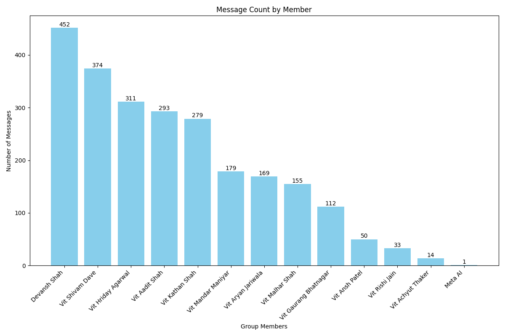
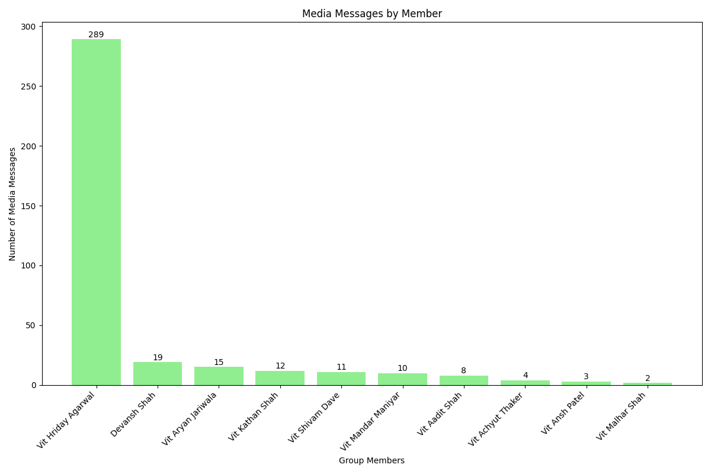
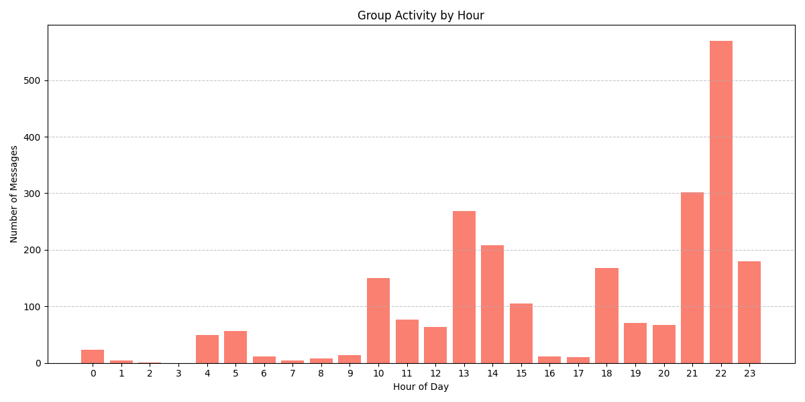
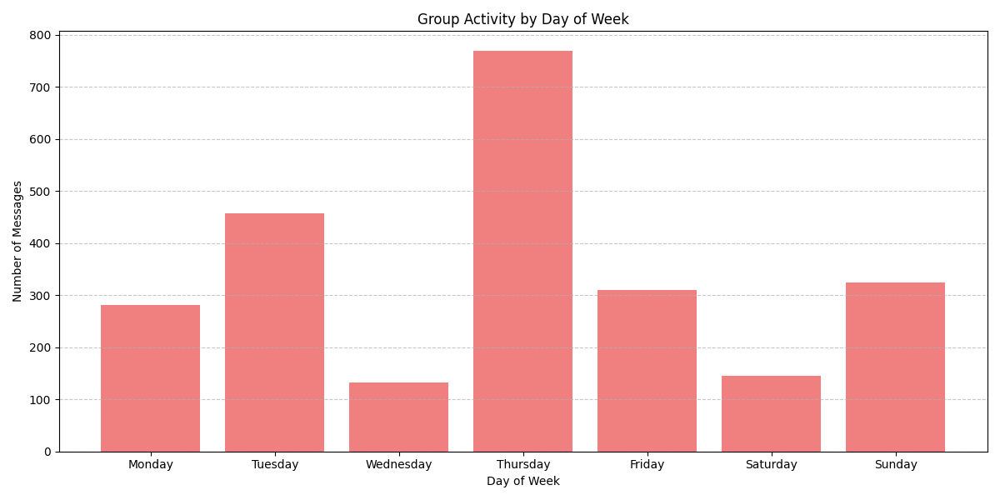
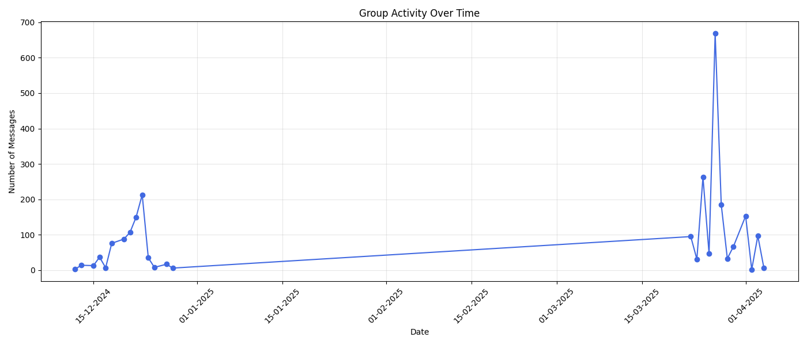
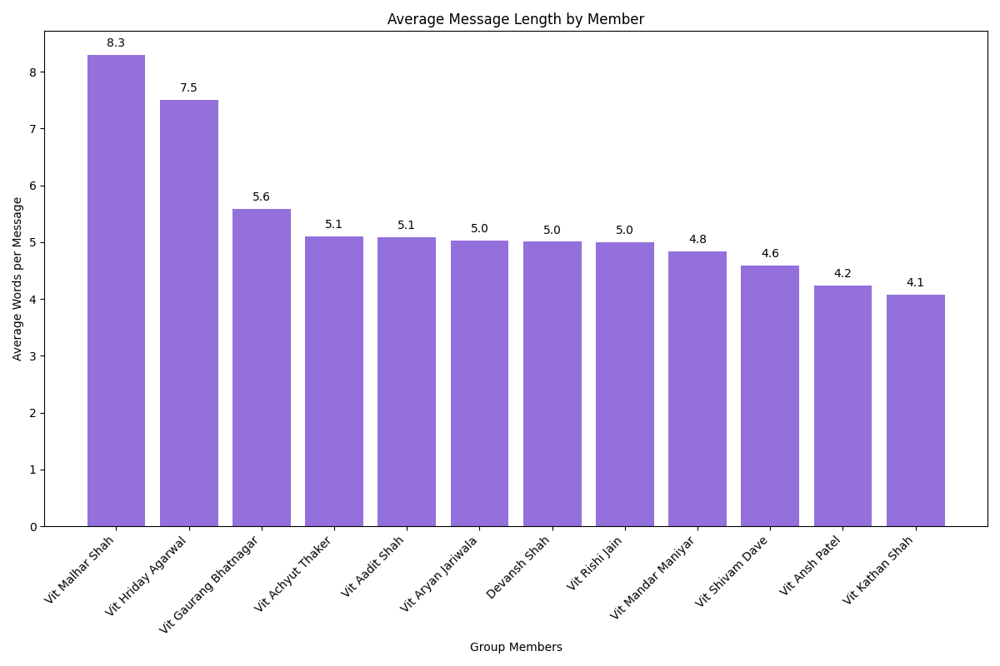
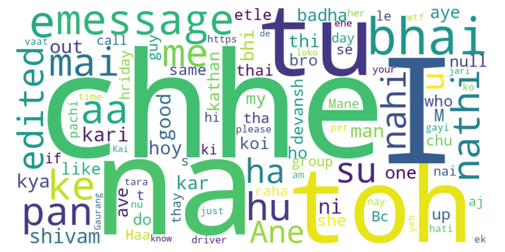
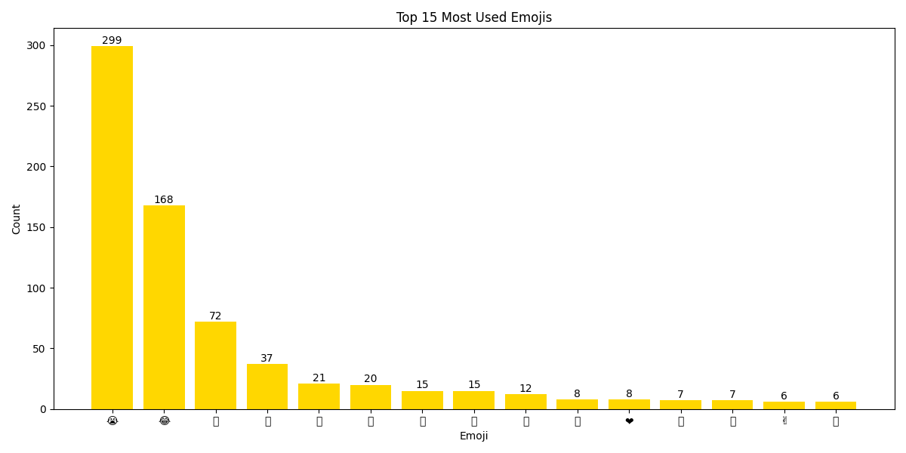

# WhatsApp Chat Analyzer

## 📊 Overview

This repository provides tools to analyze WhatsApp chat exports, generating insightful statistics and visualizations about your conversations. From message frequency to emoji usage patterns, discover hidden trends in your chats!

### Features

- 📱 **Message Analysis**: Count messages per sender in individual or group chats
- 📈 **Activity Patterns**: Track chat activity by hour, weekday, and over time
- 🔤 **Content Analysis**: Message length, word frequency, and emoji usage
- 🖼️ **Media Tracking**: See who shares the most photos, videos, and other media
- 📝 **Detailed Reports**: Generate comprehensive statistics reports
- 🌐 **Word Clouds**: Visualize most common words and phrases
- 🔍 **Advanced Filtering**: Filter analysis by date range or specific participants
- 📊 **Export Options**: Save results in various formats for further analysis
- 🌙 **Dark/Light Mode**: Choose visualization themes to suit your preference

## 🚀 Quick Start

### 1. Export Your WhatsApp Chat:
   
   **In WhatsApp:**
   - Open the chat/group you want to analyze
   - Click on options (3 dots) → More → Export chat
   - Choose "Without Media" (faster processing)
   - Share the exported text file to your computer

### 2. Basic Analysis:

```bash
python whatsapp_analyzer.py
```
Follow the prompts to select your chat file.

### 3. Deep Analysis with Visualizations:

```bash
python deep_whatsapp_analyzer.py
```
This will generate comprehensive reports and visualizations in the `output` directory.

## 📸 Sample Visualizations

### Message Count by Group Member


### Media Sharing Analysis


### Activity by Hour of Day


### Activity by Day of Week


### Chat Activity Over Time


### Average Message Length Comparison


### Word Cloud


### Emoji Usage


## 🛠️ Requirements

- Python 3.6+
- Dependencies:
  - matplotlib
  - emoji
  - wordcloud
  - numpy

Install required packages:
```bash
pip install -r requirements.txt
```

## 🧠 How It Works

1. **Parsing**: The tool parses WhatsApp chat exports with regular expressions to identify message timestamps, senders, and content
2. **Analysis**: Various counters track statistics for each sender and overall chat patterns
3. **Visualization**: Data is transformed into insightful charts and graphs using matplotlib
4. **Reporting**: A comprehensive report summarizes key findings

## 🔍 Code Structure

- `whatsapp_analyzer.py` - Basic analysis tool with message counting
- `deep_whatsapp_analyzer.py` - Advanced analysis with multiple visualization types
- `requirements.txt` - List of Python dependencies
- `output/` - Directory where all reports and visualizations are saved

## 📝 Usage Notes

- Works with both individual and group chats
- Supports different WhatsApp date/time formats
- Handles emoji analysis
- Can process large chat files efficiently

## 🔮 Future Enhancements

- Sentiment analysis of messages
- Topic modeling to identify conversation themes
- Interactive dashboard for exploring results
- Response time analysis between participants
- Multi-language support
- Conversation network visualization

## 🤝 Contributing

Contributions are welcome! If you have ideas for improvements or bug fixes:

1. Fork this repository
2. Create a new branch (`git checkout -b feature-branch`)
3. Make your changes
4. Submit a pull request

## 📜 License

This project is licensed under the MIT License - see the LICENSE file for details.

## 🙏 Acknowledgments

- WhatsApp for making chat exports available
- Open-source Python community for the amazing libraries
- All contributors to this project 